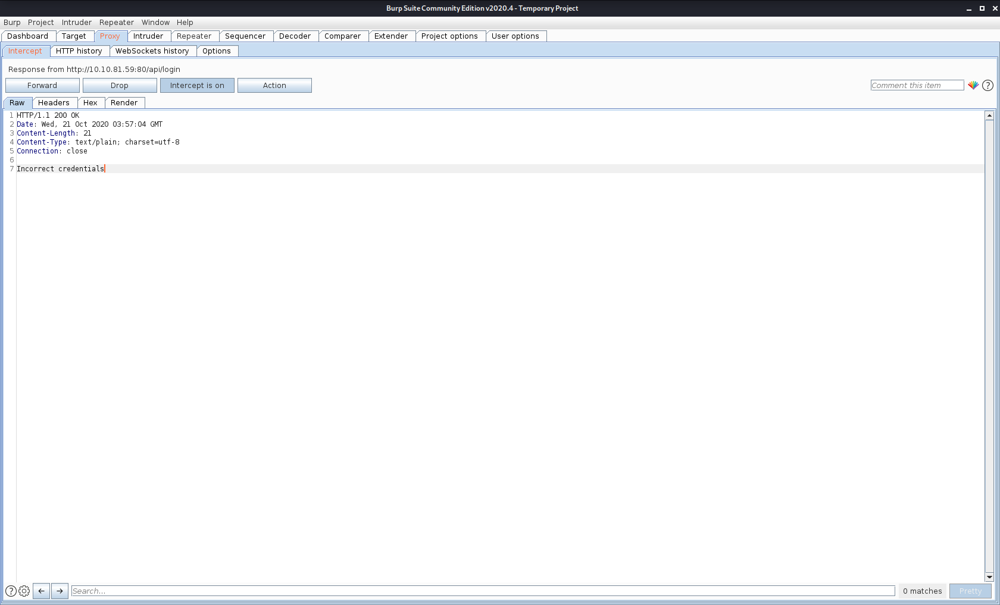
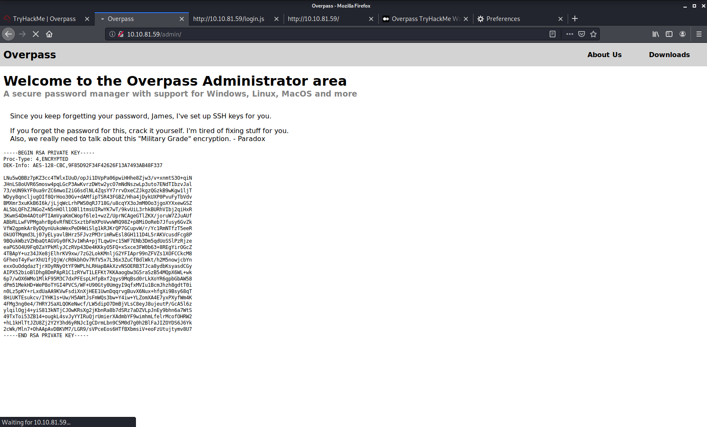

# overpass_tryhackme
overpass tryhackme room documentation

## analysing the request in burp suit 

## now modifying the response and then passing it

## now the login is bypassed why this happen this can be done via analysing the login.js file of the given ip 

